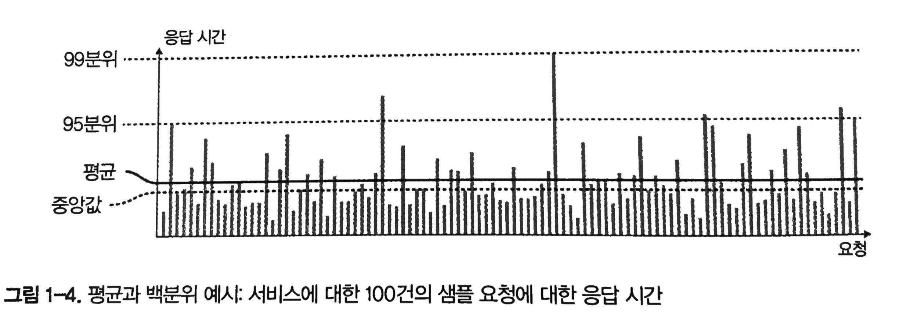

# 01장. 신뢰할 수 있고 확장 가능하며 유지보수하기 쉬운 애플리케이션

## 데이터 시스템에 대한 생각

**데이터 시스템**이라는 포괄적인 용어로 묶어야 할까?
- 분류 간 경계가 흐려짐: Redis vs Apache Kafka
- 요구사항이 광범위해서 다양한 도구들을 애플리케이션 코드를 이용해 서로 연결해야 함.
- 복합 데이터 시스템: 작은 범용 구성 요소들을 코드로 이용.
- 다양한 종류의 위험으로부터 안정적인 서비스를 하기 위한 시스템 설계에 영향을 주는 요소 파악.

## 신뢰성

무언가 잘못되더라도 지속적으로 올바르게 동작해야 함.
- 애플리케이션은 사용자가 기대한 기능을 수행.
- 결함(fault): 잘못될 수 있는 일. 사양에서 벗어난 시스템의 한 구성 요소.
- 내결함성(fault-tolerant) 또는 탄력성(resilient): 특정 유형(지구멸망제외)의 결함을 예측하고 대처할 수 있는 속성.
- 장애(failure) != 결함. 장애가 발생하지 않게끔 내결함성 구조를 설계해야 함.
- 고의로 결함을 발생시켜 내결함성 시스템 훈련 : Netflix의 [Chaos Monkey](https://github.com/Netflix/chaosmonkey)
- 보안의 경우, 해결책이 없기때문에 예방책이 더 좋음.

### 하드웨어 결함

- 늘상 일어남
- 각 하드웨어 구성 요소에 중복(redundancy)을 추가하여 대응
- 점점 더 많은 수의 장비를 사용 -> 하드웨어 결함율도 비례 증가
- 하드웨어 중복 + **소프트웨어 내결함성**

### 소프트웨어 오류

- 버그는 특정 상황에 의해 발생하기 전까지 오랫동안 나타나지 않음
- 소프트웨어는 환경에 대한 일종의 가정이 있음
- 소프트웨어의 systematic error는 신속한 해결책이 없음
- 하드웨어처럼 딱히 좋은 해결책이 없음
- 시스템의 가정과 상호작용에 대해 주의 깊게 생각하기
- 빈틈없는 테스트
- 프로세스 격리
- 죽은 프로세스의 재시작 허용
- production 환경에서 시스템 동작 측정
- 모니터링, 분석하기: 수행 중에 지속적으로 확인해 차이가 생기는 경우 경고 발생 등

### 인적 오류

- 운영자의 설정 오류가 중단의 주요 원인. 반면 하드웨어 결함은 중단 원인의 10 ~ 25%
- 오류의 가능성을 최소화하는 방향으로 시스템 설계. 예를 들어 제한된 인터페이스. 다만 지나치게 제한적이면 회피할 수 있으니 주의.
- 가장 많이 실수하는 부분을 분리. 실제 데이터로 실험할 수 있지만 서비스에 영향이 없는 non-production sandbox를 제공.
- 철저한 테스트. 단위 테스트, 전체 시스템 통합 테스트, 수동 테스트. 그리고 corner case도 다루도록.
- 오류를 빠르고 쉽게 복구할 수 있도록. 빠르게 rollback하고 새 코드를 서서히 roll out하도록. 이전 계산이 잘못된 경우를 대비해 데이터 재계산 도구를 제공.
- 명확한 모니터링 telemetry 대책 마련. 성능 지표나 오류율 등. 특정 가정이나 제한을 벗어나는지 확인.
- 조작 교육과 실습을 시행.

## 확장성

증가한 부하에 대처하는 시스템 능력.

### 부하 기술하기

부하(load)는 부하 매개변수(load parameter)로 표현 가능. 시스템 설계에 따라 달라짐. 예를 들어 다음과 같은 항목.
- 웹 서버의 초당 요청 수
- 데이터베이스의 읽기 대 쓰기 비율
- 대화방의 동시 활성 사용자 active user
- 캐시 적중률

트위터의 사례에서 핵심 부하 매개변수: 사용자당 팔로워의 분포 (팬아웃 부하를 결정하기 때문)

### 성능 기술하기

시스템 자원을 고정하고 부하매개변수를 증가시키면 *시스템 성능* 은 어떻게 영향을 받을까?
어떤 지표가 필요한가?

성능수치:
- 처리량 (throughput): 초당 처리할 수 있는 레코드 수 혹은 일정 크기의 데이터 집합으로 작업을 수행할 때 걸리는 전체 시간(예: Hadoop). (하지만 worker-balance가 깨져있다면 skew 발생)
- 응답 시간 (response time): 클라이언트가 요청을 보내고 응답을 받는 사이의 시간(예: 웹서비스). 클라이언트 관점에서 본 시간으로 서비스 시간 외에도 네트워크 지연과 큐 지연도 포함.
- 지연 시간 (latency): 요청이 처리되길 기다리는 시간.

수치는 하나의 값이라기보다는 측정 가능한 값의 분포.

#### 성능수치에 대한 지표
- 평균
- 백분위(percentile): 서비스 수준 목표(Service Level Objective, SLO), 서비스 수준 협약서 (Service Level Agreement, SLA)
- 중앙값(median): 사용자가 보통 얼마나 오랫동안 기다려야 하는지. p50 (50분위)
- 상위 백분위: p95, p99, p999. 95분위 응답시간이 1.5초라면 100개의 요청 중 95개는 1.5초 미만.

아마존의 예
- 내부서비스 응답 시간 요구사항: 99.9분위
- 응답 시간이 느린 경우는 보통 구매를 많이해서 사용자 데이터가 많은 경우 -> 소중한 고객
- 반면 99.99분위 최적화는 비용 낭비

#### head-of-line blocking

- queueing delay로 인해 소수의 느린 요청으로 후속 요청 처리가 지체
- 개별 서버 처리 시간보다 클라이언트 응답 시간을 측정해야 확인 가능.
- 꼬리 지연 증폭(tail latency amplification) 효과. 일부 백엔드 호출만 느려도 여러 번 호출하다보면 느린 호출 발생 가능성이 증가.
  - 주기적으로 백분위 계산. rolling window 유지.
  - forward decay, t-digest, hdr-histogram 등 백분위 근사치를 계산할 수 있는 좋은 알고리즘 사용.
- 백분위 평균은 수학적으로 의미가 없음.
- 인위적으로 부하를 생성하여 테스트할 때, 개별 요청이 완료된 후에 다음 요청을 보내는 것이 아니라 요청을 지속적으로 보내 서로 간섭하게 해야 함.

### 부하 대응 접근 방식

- scaling up(vertical scaling): 좀 더 강력한 장비로 이동
  - 비쌈.
  - 결국 scaling out으로 가게됨

- scaling out(horizontal scaling): 다수의 낮은 사양 장비에 부하를 분산 - shared-nothing architecture

탄력적elastic: 부하 증가를 감지하면 computing resource를 자동으로 추가.

수동으로 확장하는 시스템이 더 간단하고 운영상 예상치 못한 일이 더 적다. (추후 6장에서 다룸)
